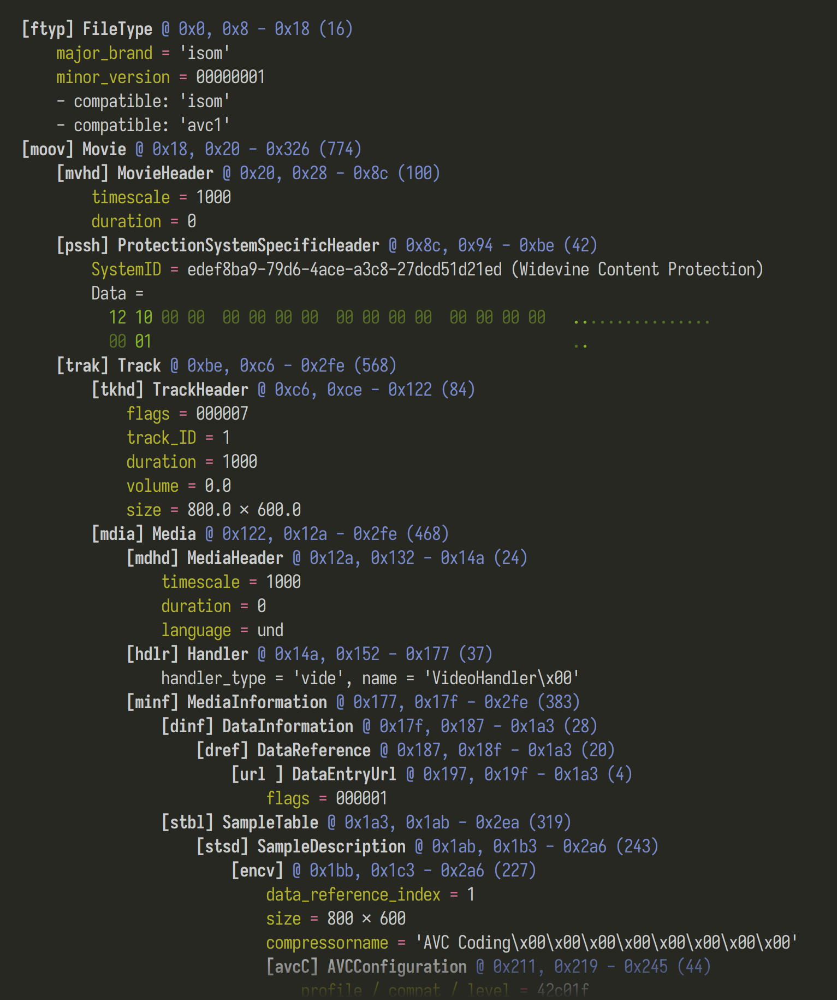

# mp4parser

[](https://codecov.io/github/mildsunrise/mp4parser)

Portable* <abbr title="ISO Base Media File Format">ISOBMFF</abbr> dissector / parser for your terminal.

Used to be hosted in [a gist](https://gist.github.com/mildsunrise/ffd74730504e4dc44f47fc7528e7bf59).

(*) Needs Python 3.8+


## Install

Clone the repo and run `./mp4parser.py <input file>`. <br>
No dependencies needed.


## Screenshots




## Usage

<!-- BEGIN USAGE -->
```
usage: mp4parser [-h] [-C] [-r N] [--offsets] [--lengths] [--descriptions]
                 [--defaults] [--indent N] [--bytes-per-line N]
                 [--senc-per-sample-iv N]
                 filename

Portable ISOBMFF dissector / parser for your terminal.

positional arguments:
  filename              input file to parse

optional arguments:
  -h, --help            show this help message and exit
  -C, --color, --no-color
                        Colorize the output [default: only if stdout is a
                        terminal]
  -r N, --rows N        Maximum amount of lines to show in tables / lists /
                        hexdumps
  --offsets, --no-offsets
                        Show file offsets of boxes / blobs (default: True)
  --lengths, --no-lengths
                        Show byte sizes of boxes / blobs (default: True)
  --descriptions, --no-descriptions
                        Show meanings of numerical field values (default:
                        True)
  --defaults, --no-defaults
                        Show all fields, even those with default values
                        (default: False)
  --indent N            Amount of spaces to indent each level by
  --bytes-per-line N    Bytes per line in hexdumps

box-specific parsing parameters:
  Though very uncommon, parsing of some boxes may be dependent on parameters
  derived from other boxes. These arguments allow manually supplying
  parameters to allow parsing the boxes. Without them, parsing usually falls
  back to a hexdump.

  --senc-per-sample-iv N
                        Value of Per_Sample_IV_Size when parsing senc boxes
```
<!-- END USAGE -->


## Goals / development guidelines

  - **Low level.** Meant as a dissector, i.e. to obtain info about the structure of the file rather than high level info.

  - **Print offsets to every box** to let users inspect deeper. If parsing fails, print an error for that particular box followed by a hexdump.

  - **Don't parse non-MP4 structures.** It is fine to parse the info in the MP4 boxes, as long as this info is specific to MP4. Examples of things we don't parse:
     - Codec-specific structures (SPS, PPS)
     - ID3v2 blobs
     - H.264 NALUs
     - XML
     - ICC profiles

    These blobs are just left as hexdump, with their offsets / length printed in case the user wants to dive deeper.
    The only exception is when this info is needed to dissect other MP4 boxes correctly.

  - **Focus on dissection, not parsing.** First priority is to show the box structure correctly
    and to 'dig as deeper as possible' if there are nested boxes; decoding non-box info
    (instead of showing hexdumps) is second priority.

  - **Print every field on the wire**, with only minimal / mostly obvious postprocessing.
    - Exception: versions / flags that are restricted to a single value.
    - Exception: values which have a default (`template`) set by spec, which may be omitted from output if the value is set to the default, and `show_defaults` was not set.
    - Exception: big boxes, or long rows of output, may be summarized through the
    `max_dump` (for hexdumps) and `max_rows` (for tables) options.

  - **Option to hide lengths / offset** (for i.e. diffs).

  - In the future we should have options to make the output interoperable (make it machine friendly like JSON), don't use global variables for config/state, allow output to a different file (for programmatic use).

  - Parsed fields should be named exactly like in the spec's syntax.
    Both in code, and in the output.

  - **Performance isn't the main concern.** Correctness is more important, but it's also nice for the code to be 'hacker-friendly' for people who may want to tweak it. However the parser must be streaming and not collect fields or boxes in memory, so that it works with giant files.
